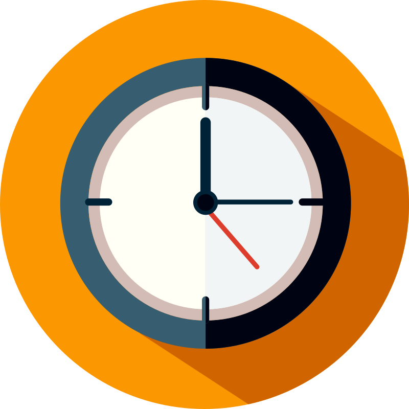

# My Clock

  

My clock is a small and simple application to view clock by resolution in seconds.

## Technology get use

In is projcet use [Tauri](https://tauri.app/) to create this application by code use for [Rust](https://www.rust-lang.org/) but it is not use so much in this projcet.

But much of projcet is develop in anilla HTML, CSS and Typescript.

## Recommended IDE Setup

- [VS Code](https://code.visualstudio.com/) + [Tauri](https://marketplace.visualstudio.com/items?itemName=tauri-apps.tauri-vscode) + [rust-analyzer](https://marketplace.visualstudio.com/items?itemName=rust-lang.rust-analyzer)
